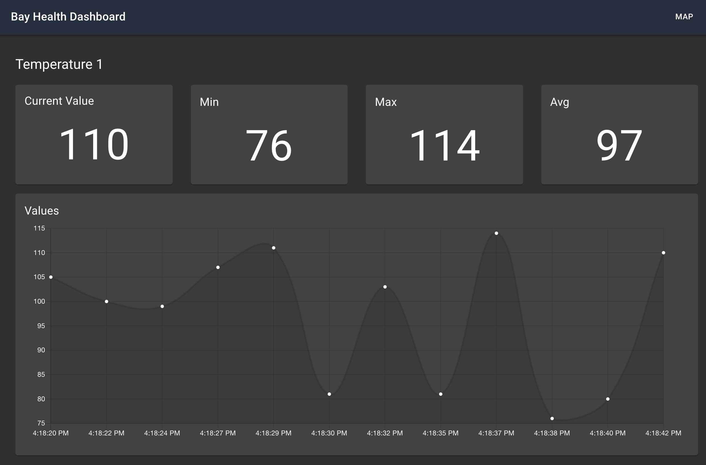

# aws-appsync-iot-core-realtime-dashboard

This application demonstrates a web application dashboard receiving real-time updates from a series of IoT sensors.  It depicts a fictitious set of pH sensors deployed around the San Francisco Bay. The solution is built with React, AWS AppSync, and AWS IoT Core technologies.


The sensors are represented as the colored dots.  Their color will fluxuate between red, green, and yellow based on the messages received from the sensors.

Click on a sensor to view the detailed values received in realtime from that specific sensor.



## Architecture


1. The sensor component is developed with the AWS IoT Device SDK for Javascript.  The sensor is registered as a Thing in IoT Core and publishes random pH values for six sensors in a JSON payload to the Cloud every 2 seconds.

2. A rule in IoT Core subscribes to the message topic and forwards the JSON payload to a Lambda function.

3. The Node js Lambda function executes a GraphQL mutatation in AppSync.  The mutation saves the latest value for the sensor in DynamoDB and broadcasts the latest value in real-time to the iOS application. The Lambda function uses an IAM role and policy to obtain permissions to interact with AppSync.

4. The React web dashboard application is written in Typescript and subscribes to the AppSync sensor update subscriptions.  When new  values are received, the map on the screen is updated in real-time to reflect the new sensor values. The application uses Cognito to authenticate users and allow them to perform the AppSync subscription. 

## Getting Started

### **Prerequisites**

1. An AWS account in which you have Administrator access.

2. [Node JS](https://nodejs.org/en/download/) (^10.0) with NPM (^5.2)

3. [Amplify CLI](https://aws-amplify.github.io/docs/) (^4.0.0).
4. A [Mapbox](https://www.mapbox.com/) account with a free *Default Public Access Token*

After you have installed and configured Amplify, take note of the AWS profile you selected during the configuration.  If you created a profile other than **default**, you will need the profile name for later steps in the deployment.

### **Installing**

If you run into issues installing or configuring anything in this project please checkout the [Troubleshooting](#troubleshooting) section below.


**Clone this code repository**

```
$ git clone https://github.com/aws-samples/aws-appsync-iot-core-realtime-dashboard.git
```

**Switch to the app's folder and initialize your Amplify environment**

```
$ cd aws-appsync-iot-core-realtime-dashboard
$ amplify init

? Enter a name for the environment: mysandbox
? Choose your default editor: [select your favorite IDE]
? Do you want to use an AWS profile? Yes
? Please choose the profile you want to use: default
```

When you select your profile, make sure to select the same profile you used when configuring Amplify.

Amplify will then begin to provision your account for the project deployment.

Once your account has been provisioned, entering the 'amplify status' command will show you the resources Amplify will create in your account:

```
$ amplify status
```

**Deploy the app infrastructure to your AWS account**

```
$ amplify push

? Do you want to update code for your updated GraphQL API (Y/n) Y

? This will overwrite your current graphql queries, mutations and subscriptions Y
```
You will then see a series of output messages as Amplify builds and deploys the app's CloudFormation Templates, creating the app infrastucture in your AWS account. 

Resources being created in your account include:

- AppSync GraphQL API
- DynamoDB table
- Cognito user pool
- Lambda functions (2)
- IoT Rules (2)

**Install the web app's Node js packages**

```
$ npm install
```

**Configure Mapbox API key**

This application uses maps from [Mapbox](https://www.mapbox.com/) to display the sensor locations.  You must create an account and request a free ***default access token***.  Once you have the token, update the ***src/settings.json*** file with the token value.

***src/settings.json***
```
{
    "mapboxApiAccessToken": "your-token-here"
}
```

**Install the IoT sensor simulator**

Open a new terminal window then switch to the app's sensor folder (aws-appsync-iot-core-realtime-dashboard/sensor). 

Install the Node js packages, and run the Node js app to create your sensor as a 'Thing' in AWS IoT Core.  It will also create and install the certificates your sensor needs to authenticate to IoT Core.

```
$ cd sensor
$ npm install
$ node create-sensor.js
```

*Note - this will create the sensor using your default AWS profile account and region.  If you have not specified a default region in your local AWS configuration, it will default to us-east-1.

If you do not have a **default** profile or you are using a profile other than **default**, run the app with an AWS_PROFILE environment variable specifiying the profile name you would like to use.

Replace [my-aws-profile] with the name of your profile:

```
$ AWS_PROFILE=[my-aws-profile] node create-sensor.js
```

## Run the App

**Start the IoT Sensor**

From the sensor terminal window:

```
$ node index.js
```
You will see output from the app as it connects to IoT Core and publishes new messages for six sensors every two seconds.

```
published to topic cmd/sensors/sensor-1/sensor-create {"status":1,"value":0,"timestamp":1570562143384}

published to topic dt/sensors/sensor-1/sensor-value {"status":2,"value":80,"timestamp":1570562145788}

published to topic dt/sensors/sensor-1/sensor-value {"status":3,"value":84,"timestamp":1570562147790}
```
Keep this app running and switch to the terminal window for the **root** folder for the app.

**Start the web app**

Switch back to the terminal window pointing to the **root** folder and run:

```
$ npm start
```
This will launch the application in your machine's default web browser.

**Sign-up and Sign-in**

The web app requires users to authenticate via Cognito.  The first screen you will see is a logon screen.  Click the **Create account** link and create a new account using your email address.

Cognito will then email you a confirmation code.  Enter this code into the subsequent confirmation screen and logon to the app with your credentials.

**Use the App!**

You should now see a screen similar to the one at the top of this guide.  If you look at the terminal window running the sensor app, you shoud see the values being published to the Cloud reflected in the web app's sensor gauge in real-time.

From the initial map screen, click on a sensor to navigate to the sensor's detail page.

## Cleanup

Once you are finished working with this project, you may want to delete the resources it created in your AWS account.  From the **root** folder:

```
$ amplify delete
? Are you sure you want to continue? (This would delete all the environments of the project from the cloud and wipe out all the local amplify resource files) (Y/n)  Y
```

## Troubleshooting

**Installing Amplify**
```
$ npm install -g @aws-amplify/cli
```

If you receive EACCES permisisons errors, make sure your system is setup properly to install global packages.  See this [Guide for options](https://docs.npmjs.com/resolving-eacces-permissions-errors-when-installing-packages-globally).

## License

This sample code is made available under a modified MIT-0 license. See the LICENSE file.
