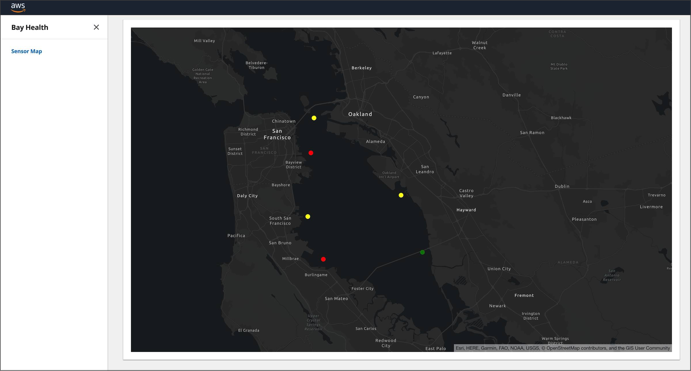

# Realtime IoT Dashboard with AWS AppSync and Amazon Location Service

This application demonstrates a web application dashboard receiving real-time updates from a series of IoT sensors.  It depicts a fictitious set of pH sensors deployed around the San Francisco Bay. The solution is built with React, AWS AppSync, Amazon Location Service, AWS Amplify, and AWS IoT technologies.



The sensors are represented as the colored dots.  Their color will fluxuate between red, green, and yellow based on the messages received from the sensors.

## Architecture


1. The sensor component is developed with the AWS IoT Device SDK for JavaScript.  The sensors are registered as _Things_ in IoT Core and publish random values to the Cloud on a configurable frequency.  Metadata about each sensor, such as its geolocation, is stored in a _Thing Shadow_.

2. Rules in IoT Core subscribe to the message topic and forward the JSON payload to a Lambda function and the IoT Analytics pipeline.

3. The Node.js Lambda function executes a GraphQL mutation in AppSync.  The mutation saves the sensor's value in DynamoDB and broadcasts the value in real-time to the web dashboard. The Lambda function uses an IAM role and policy to obtain permissions to interact with AppSync.

4. The React web dashboard application is written in TypeScript and subscribes to the AppSync sensor subscriptions.  When new values are received, an Amazon Location Service map is updated in real-time to reflect the new sensor values. The application uses Cognito to authenticate users and allow them to perform the AppSync subscription. 

## Getting Started

## **Prerequisites**
The following software was used in the development of this application.  While it may work with alternative versions, we recommend you deploy the specified minimum version.

1. An AWS account in which you have Administrator access.

2. [AWS CLI](https://docs.aws.amazon.com/cli/latest/userguide/install-cliv2.html) (2.4.19) the AWS Command Line Interface (CLI) is used to configure your connection credentials to AWS.  These credentials are used by the CDK, Amplify, and the CLI.

3. [Node.js](https://nodejs.org/en/download/) (^16.8.1) with NPM (^8.12.2)

4. [Amplify CLI](https://docs.amplify.aws/cli/start/install) (^10.6.1) Amplify is used to create the AWS AppSync API and generate the client side Swift code to interact with AWS.

After you have installed and configured Amplify, take note of the AWS profile you selected during the configuration.  If you created a profile other than **default**, you will need the profile name for later steps in the deployment.

## **Installation**

**Clone this code repository**

```
$ git clone https://github.com/aws-samples/aws-appsync-iot-core-realtime-dashboard.git
```

**Switch to the project's web folder**

```
$ cd aws-appsync-iot-core-realtime-dashboard/web
```

**Install the web app's Node.js packages**

```
$ npm install
```

**Initialize your Amplify environment**

```
$ amplify init

? Enter a name for the environment: mysandbox
? Choose your default editor: [select your favorite IDE]
? Select the authentication method you want to use: AWS Profile
? Please choose the profile you want to use: default
```

When you select your profile, make sure to select the same profile you used when configuring Amplify.

Amplify will then begin to provision your account for the project deployment.

Once your account has been provisioned, entering the 'amplify status' command will show you the resources Amplify will create in your account:

```
$ amplify status

Current Environment: dev

┌──────────┬───────────────────┬───────────┬───────────────────┐
│ Category │ Resource name     │ Operation │ Provider plugin   │
├──────────┼───────────────────┼───────────┼───────────────────┤
│ Api      │ bayhealth         │ Create    │ awscloudformation │
├──────────┼───────────────────┼───────────┼───────────────────┤
│ Auth     │ web1b7b454d       │ Create    │ awscloudformation │
├──────────┼───────────────────┼───────────┼───────────────────┤
│ Custom   │ iotrule           │ Create    │ awscloudformation │
├──────────┼───────────────────┼───────────┼───────────────────┤
│ Function │ createsensorvalue │ Create    │ awscloudformation │
├──────────┼───────────────────┼───────────┼───────────────────┤
│ Function │ listsensors       │ Create    │ awscloudformation │
├──────────┼───────────────────┼───────────┼───────────────────┤
│ Geo      │ map0102348f       │ Create    │ awscloudformation │
└──────────┴───────────────────┴───────────┴───────────────────┘
```

**Deploy the app infrastructure to your AWS account**

```
$ amplify push

? Are you sure you want to continue? Y
? Do you want to update code for your updated GraphQL API (Y/n) Y

? This will overwrite your current graphql queries, mutations and subscriptions Y
```
You will then see a series of output messages as Amplify builds and deploys the app's CloudFormation Templates, creating the app infrastucture in your AWS account. 

Resources being created in your account include:

- AppSync GraphQL API
- DynamoDB Table
- Cognito User Pool
- Lambda Functions (3)
- IoT Rule
- IoT Analytic
- Amazon Location Service Map


**Install the IoT sensor simulator**

Open a new terminal window then switch to the app's **sensor** folder (aws-appsync-iot-core-realtime-dashboard/sensor). 

Install the Node js packages, and run the Node js app to create your sensor as a _Thing_ in AWS IoT Core.  It will also create and install the certificates your sensor needs to authenticate to IoT Core.

From the app's **sensor** folder:

```
$ npm install
$ node create-sensors.js
```

*Note - this will create the sensors using your default AWS CLI profile*

If you do not have a **default** profile or you are using a profile other than **default**, run the app with an AWS_PROFILE environment variable specifiying the profile name you would like to use.

Replace [my-aws-profile] with the name of your profile:

```
$ AWS_PROFILE=[my-aws-profile] node create-sensors.js
```

## Run the Web App

**Start the IoT Sensor**

From the **sensor** terminal window:

```
$ node index.js
```
You will see output from the app as it connects to IoT Core and publishes new messages for six sensors every few seconds.

```
published to shadow topic $aws/things/sensor-sf-north/shadow/update {"state":{"reported":{"name":"SF Bay - North","enabled":true,"geo":{"latitude":37.800307,"longitude":-122.354788}}}}

published to telemetry topic dt/bay-health/SF/sensor-sf-north/sensor-value {"pH":5,"temperature":54.7,"salinity":25,"disolvedO2":6.1,"timestamp":1591831843844}
```

**Start the web app**

Switch back to the terminal window pointing to the **web** folder and run:

```
$ npm start
```

This will launch the application in your machine's default web browser.

**Sign-up and Sign-in**

The web app requires users to authenticate via Cognito.  The first screen you will see is a logon screen.  Click the **Create account** link and create a new account using your email address.

Cognito will then email you a confirmation code.  Enter this code into the subsequent confirmation screen and logon to the app with your credentials.

**Use the Web App**

You should now see a screen similar to the one at the top of this guide.  If you look at the terminal window running the sensor app, you shoud see the values being published to the Cloud reflected in the web app's sensor icon in real-time.

## Cleanup

Once you are finished working with this project, you may want to delete the resources it created in your AWS account.  

From the **web** folder:

```
$ amplify delete
? Are you sure you want to continue? (This would delete all the environments of the project from the cloud and wipe out all the local amplify resource files) (Y/n)  Y
```

From the **sensor** folder:

```
$ node delete-sensors.js
```

*Note - this will delete the sensors using your default AWS CLI profile*

If you do not have a **default** profile or you are using a profile other than **default**, run the app with an AWS_PROFILE environment variable specifiying the profile name you would like to use.

Replace [my-aws-profile] with the name of your profile:

```
$ AWS_PROFILE=[my-aws-profile] node delete-sensors.js
```

## License

This sample code is made available under a modified MIT-0 license. See the LICENSE file.
